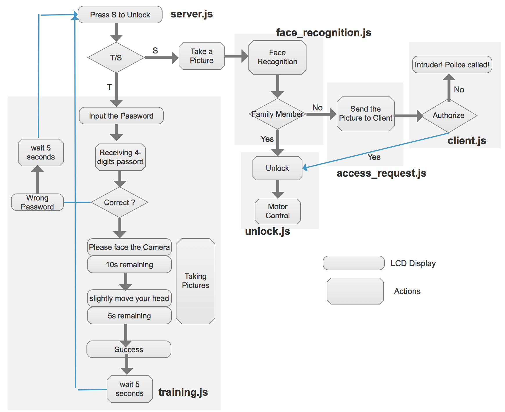

# Overview
Whoever clickes the "S" button, the server will take a picture of him. Our face recognition model will determine whether he is one of the authorized family member. For an authorized family member, the Box will unlock automatically. 

In order to make the system being able to recognize his family member, the owner needs to train our face recognition model by following instructions on the LCD screen.

For a stranger, the server will send the picure of the person to Client (Webpage or MobileApp). One the client side, the owner can authorize the stranger to unlock the box. 

# Server

# Arduino
## Button Click

If any button is pressed or released, the arduino will write the following string to the serial port. 
 
Pressed\_T, Released\_T
 
Pressed\_S, Released\_S
 
Pressed\_0, Released\_0
 
Pressed\_1, Released\_1

## LED Control
The server needs to write 'H' to the serial port to turn on the LED, and write 'L' to turn off LED.

## LCD Display
Write what the server want on the LCD to the serial port. The Arduino code will handle everything. 

# Client
After receiving access request from the server and the image in front of the camera, the client can choose authorize or not.

