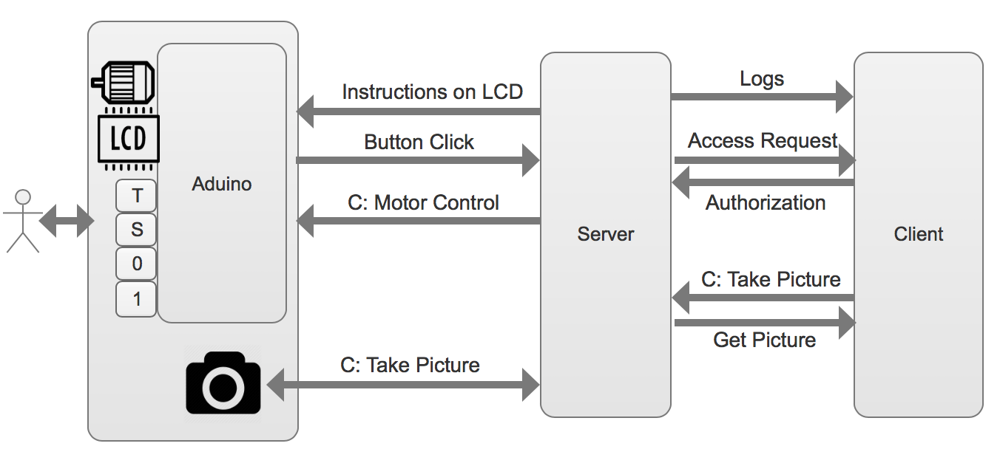

# Overview

Whoever clickes the "S" button, the server will take a picture of him and determine whether he is one of the authorized user. For an authorized family member, the Box will open automatically. 

In order to open the box automatically, the owner needs to input images of his family member. These images will be used to train our face recognition model. 

For a stranger, the server will send the picure of the person to Client (Webpage or MobileApp). One the client side, the owner can authorize the stranger to open the box. 

# Arduino
## Button Click

If any button is pressed or released, the arduino will write the following string to the serial port. 

 
Pressed\_T, Released\_T
 
Pressed\_S, Released\_S
 
Pressed\_0, Released\_0
 
Pressed\_1, Released\_1

## LED Control
The server needs to write 'H' to the serial port to turn on the LED, and write 'L' to turn off LED.

## LCD Display
Write what the server want on the LCD to the serial port. The Arduino code will handle everything. 

## Motor Control

#Client
After receiving access request from the server and the image in front of the camera, the client can choose authorize or not. 
