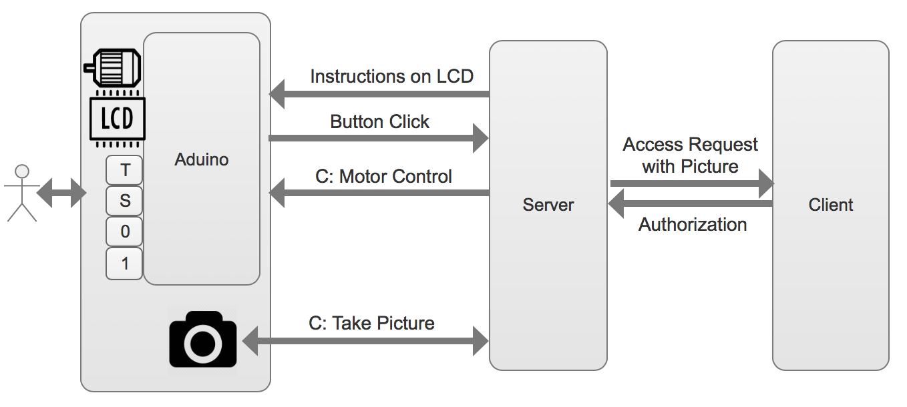

# Overview

# Arduino
## Button Click

If any button is pressed or released, the arduino will write the following string to the serial port. 

 
Pressed\_T, Released\_T
 
Pressed\_S, Released\_S
 
Pressed\_0, Released\_0
 
Pressed\_1, Released\_1

## LED Control
The server needs to write 'H' to the serial port to turn on the LED, and write 'L' to turn off LED.

## LCD Display
Write what the server want on the LCD to the serial port. The Arduino code will handle everything. 
